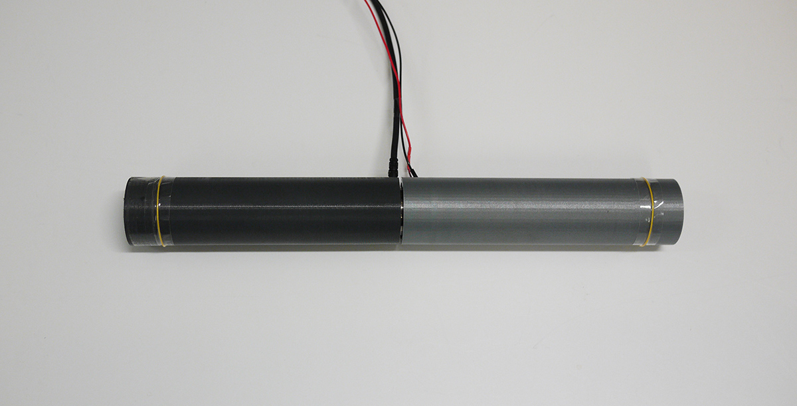
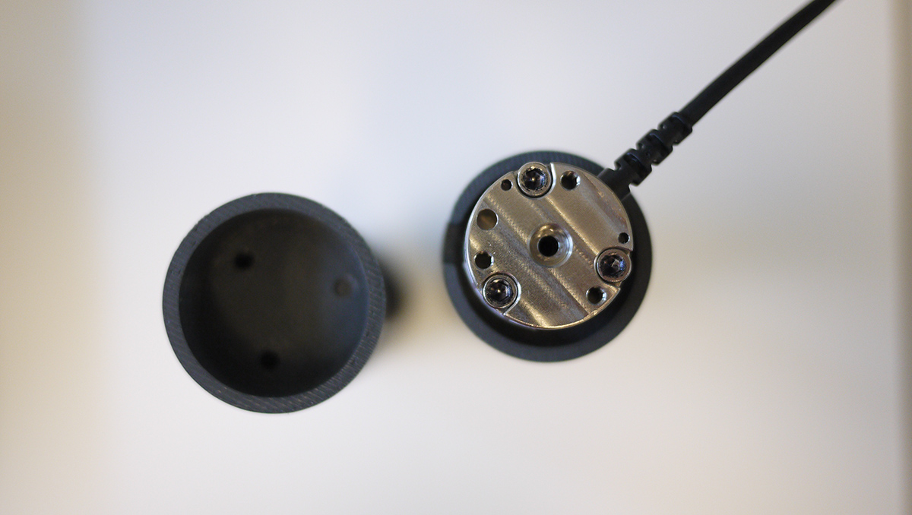
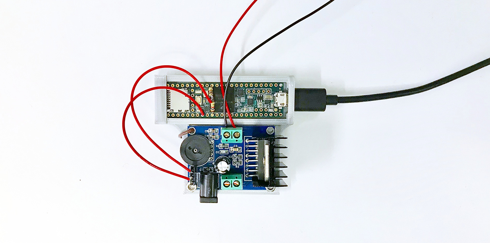

# PseudoBend

PseudoBend paper is available at here: https://dl.acm.org/citation.cfm?id=3347941

See Video Preview: https://www.youtube.com/watch?v=w7GSAcuDjo4&feature=youtu.be

PseudoBend is a haptic feedback technique that uses grain vibrations to create illusions of stretching, bending, and twisting on a rigid device. Details of PseudoBend will be publised as a paper at ACM UIST 2019.

This repository contains resources required to replicate PseudoBend, including 3D models to print handles, schematic and firmware for signal generation circuit, and PseudoBend software.  

To build the system, you may need the following parts, in addition to the 3D-printed handles. These are the parts used in the implementation in the paper, but you can use alternate parts with similar characteristics.

* Sensor: ATI Nano25 6-DOF Force/Torque Sensor (https://www.ati-ia.com/products/ft/ft_models.aspx?id=Nano25)
* Micro Controller: Teensy 3.6 (https://www.sparkfun.com/products/14057)
* Actuator: Haptuator BM2C (http://tactilelabs.com/wp-content/uploads/2016/06/Haptuator-BMXC-series-v1.1.pdf)
* Amplifier: TDA7297 Audio Amplifier (https://www.amazon.com/DROK-TDA7297-15W-Amplifier-Component/dp/B00C4MT274)

The complete device looks like the picture below, with a force/torque sensor installed in between the two handles.

Nano25 sensor connects the two handles. Three M3 screws connects each handle and the sensor.  

Teensy 3.6 board generates the vibration signal using its DAC pin. TDA7297 amplifies the signal generated by the Teensy board.  

If you have any questions, please send an email to seongkook@dgp.toronto.edu
